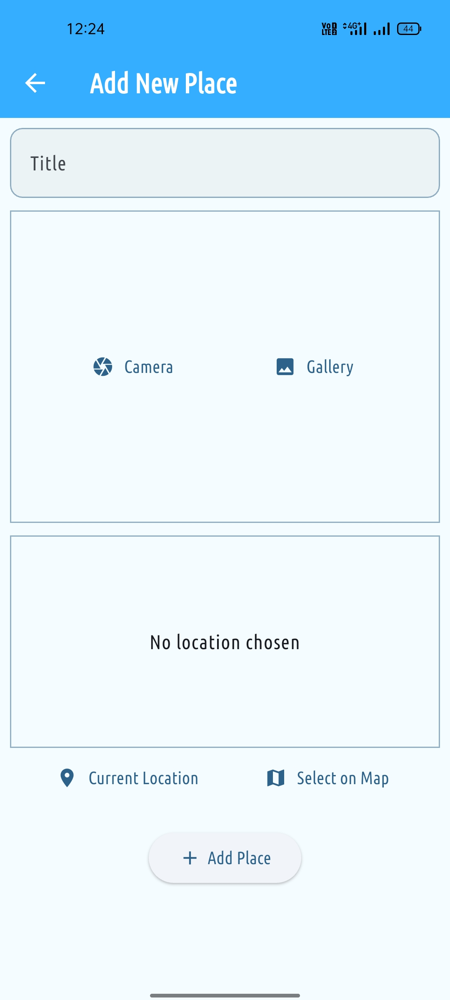
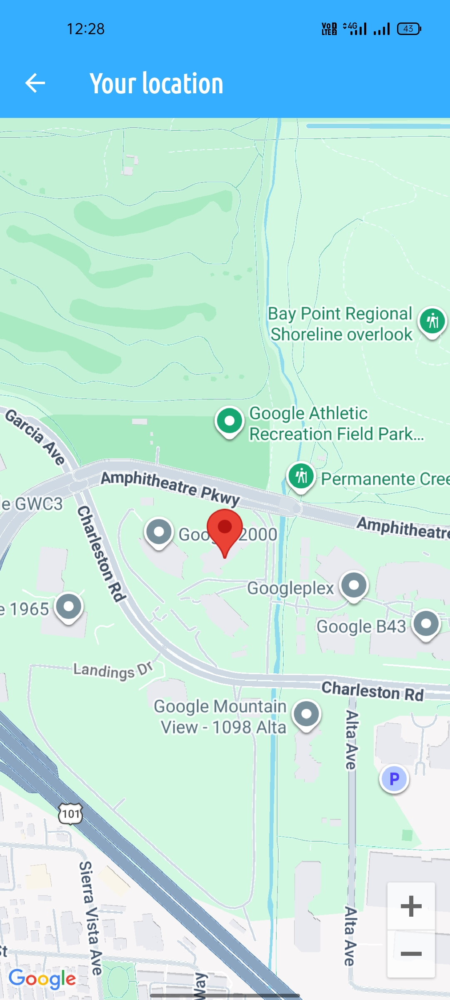
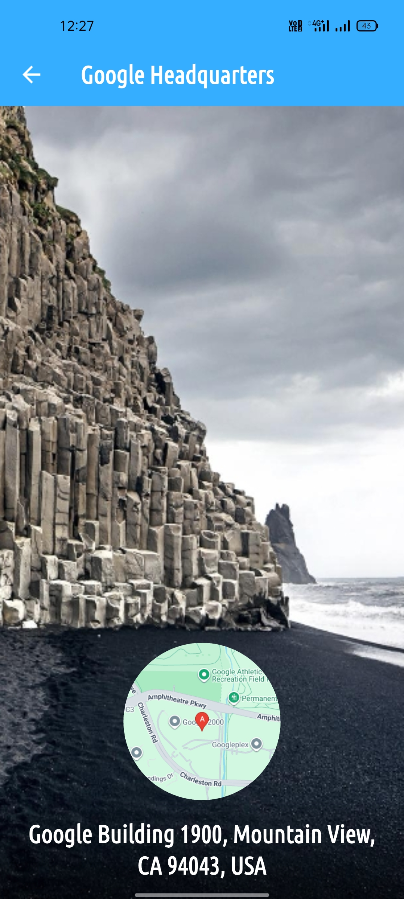
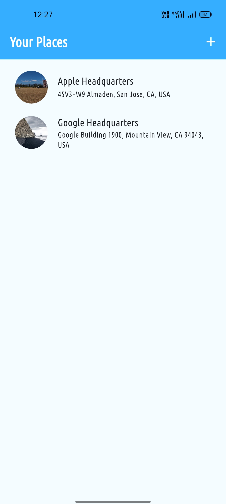

# 📍 Favorite Places App

A sleek, modern Flutter application that allows users to save and manage their favorite locations with titles, photos, and real-time geographic data.  
Built using **Riverpod** for state management and **Google Maps API** for location services.

---

## ✨ Features

- 📸 **Capture Memories**  
  Take photos using the camera or select from your gallery.

- 🌍 **Geocoding**  
  Automatically converts GPS coordinates into a readable address.

- 🎨 **Smart UI**  
  Adaptive **Sky Blue theme** with Light and Dark mode support.

- 💾 **Data Persistence**  
  Saves your places locally so they remain available between sessions.

- ⌨️ **Smooth UX**  
  Automatically dismisses the keyboard on tap.

---

## 📸 Screenshots

<p align="center">
  
  
  
</p>

<p align="center">
  
  
</p>

---

## 🛠️ Tech Stack

- **Framework:** Flutter  
- **State Management:** Riverpod  
- **Location Services:** Google Maps API  
- **Image Handling:** Image Picker  
- **HTTP Client:** http  

---

## 🚀 Setup & API Key Security

This project uses `flutter_dotenv` to securely manage API keys.

### 1. Prerequisites

- A Google Cloud project with:
  - Geocoding API enabled  
  - Maps Static API enabled  

---

### 2. Environment Configuration

Create a `.env` file in the root directory:

```env
GOOGLE_MAPS_API_KEY=your_api_key_here
```

> ⚠️ The `.env` file is already included in `.gitignore` to keep your API key secure.

---

### 3. Installation

```bash
# Clone the repository
git clone https://github.com/your-username/favorite_places.git

# Navigate into the project
cd favorite_places

# Install dependencies
flutter pub get

# Run the app
flutter run
```

---

## 🎨 Themes

| Mode        | Colors              | Description                                      |
|------------|--------------------|--------------------------------------------------|
| Light Mode | Sky Blue & White   | Clean and airy aesthetic for daytime use         |
| Dark Mode  | Sky Blue & Black   | High-contrast, easy-on-the-eyes dark interface   |

---

## 🛡️ License

Distributed under the **MIT License**.  
See `LICENSE` for more information.
